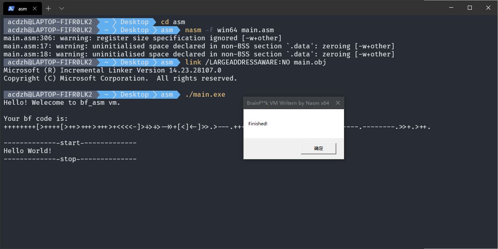
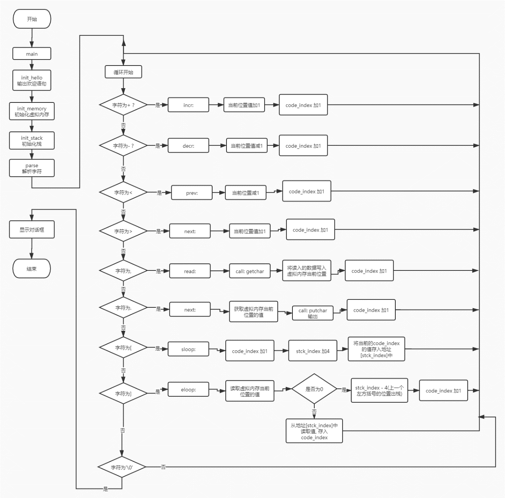

# 64位汇编实现的BrainFuck语言解释器

## 项目概述

### 1. 项目背景

BrainFuck语言是一种极小化的图灵完备语言, 它是由Urban Müller在1993年创建的. 详细的介绍可以看这个链接. [https://baike.baidu.com/item/Brainfuck](https://baike.baidu.com/item/Brainfuck)

我在之前曾经用过C++来实现这个语言的一个解释器[acdzh/BrainFuckVM](https://github.com/acdzh/BrainFuckVM/blob/master/src/bl.cc). 这个项目是该解释器的核心功能在64位汇编下的实现. 

### 2. 运行环境

汇编器：`nasm v2.14.02`

链接器：`link v14.23.28107.0` (包含在微软msvc工具集中), 或者 `ld v2.30` (包含在 `gcc v8.1.0`中)

运行：

```bash
nasm -f win64 main.asm -o main.obj
link /LARGEADDRESSAWARE:NO mian.obj
./main.exe
```

或者

```bash
nasm -f win64 main.asm -o main.obj
gcc mian.obj
./main.exe
```

### 3. 项目使用

该项目虚拟出了一块长度可变的虚拟内存空间,  之后对存储在数据区的bf代码进行解释执行,  并输出相应的结果. 

下面是一段bf输出“Hello World”的源程序. 

```brainfuck
++++++++[>++++[>++>+++>+++>+<<<<-]>+>+>->>+[<]<-]>>.>---.+++++++..+++.>>.<-.<.+++.------.--------.>>+.>++.
```

下面是该程序解释运行的结果


  
## 项目架构

### 宏定义区

```nasm
MEMORY_SIZE equ 1000
STACK_SIZE equ 1000
CODE_SIZE equ 1000
```

这一部分定义了一些后面要用到的常量. 

`MEMORY_SIZE`是虚拟内存区的大小,  `STACK_SIZE`是虚拟（循环）栈区的大小,  `CODE_SIZE`是包含源代码的数据区的大小. 

### 数据段`section .data`

```nasm
section .data
    var_str_title   db      'BrainF**k VM Writern by Nasm x64', 0
    var_str_0       db      'Hello! Welecome to bf_asm vm.', 10,  0
    var_str_1       db      'Your bf code is: ', 0
    var_str_2       db      10, '--------------start--------------', 0
    var_str_3       db          '--------------stop---------------', 0
    var_str_4       db      'Finished!', 0
    var_str_5       db      'Please input corret argvs.', 0
    var_test        db      'test.bf', 0
    code            db      '++++++++[>++++[>++>+++>+++>+<<<<-]>+>+>->>+[<]<-]>>.>---.+++++++..+++.>>.<-.<.+++.------.--------.>>+.>++.', 0
    ;code            db      '++++++[>+++++[>+++<-]<-]>>.', 0
    ;code            resb    CODE_SIZE
    memory          resb    MEMORY_SIZE ;The vm memory
    stack           resd    STACK_SIZE ; 
    code_index      dd 0
    mery_index      dd 0
    stck_index      dd 0
    file_point      dd 0, 0
    f_read_sign         db 'r' , 0
    printf_format_d     db '%d'
    printf_format_c     db '%c'
    printf_format_s     db '%s'
    printf_format_s_CR  db '%s', 10
```

这一块分为了几部分.  第一部分是一些要用到的常量字符串. 第二部分是包含bf源代码的代码块`code`,  存储循环的栈`memory`,  以及作为虚拟内存的`stack`. 

之后是一些记录源码执行位置的变量`code_index`, 记录栈顶位置的变量`stck_index`等. 

再之后是一些用于调用`printf`和`fopen`函数的参数. 

### 代码段 `section.text`

这部分整体架构如下：
 


#### init_hello

```nasm
init_hello:
push rbp
mov rbp, rsp
sub rsp, 48
push rcx
    mov rcx, var_str_0  ; print_hello
    call puts

    mov rcx, var_str_1
    call puts

    mov rcx, code
    call puts

    mov rcx, var_str_2
    call puts
pop rcx
add rsp, 48
pop rbp
ret
```

这个函数的功能是输出欢迎语句. 

#### init_memory, init_stack（98行 – 124行）

这两个函数的功能是利用循环, 使虚拟内存和栈所有内容都初始化为0

#### prase

这个函数的功能是循环遍历源码的每一个字符,  并根据字符的值,  跳转往对应的处理程序. 

#### incr（+）, decr（-）, read（, ）, print（.）, sloop（[）, eloop(])

这几个函数是根据具体的操作函数. 实现了不同字符对应的实际操作. 

其中循环的实现依赖`sloop` (进入循环) 和`eloop` (退出循环) 两个函数. 

进入循环前,  当前代码位置入栈, 之后程序继续执行. 退出循环时,  先判断当前是否可以退出循环, 如果可以, 将之前保存的代码位置出栈, 继续执行. 否则, 程序跳转至之前保存的代码位置. 

#### 其他

这部分声明了一些链接时要使用的依赖库. 

```nasm
section .drectve info 
        db      '/defaultlib:user32.lib /defaultlib:msvcrt.lib /defaultlib:legacy_stdio_definitions.lib '
```

